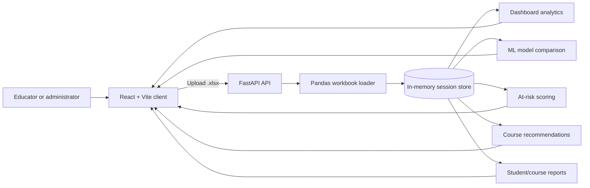

# Student Course Analyzer Platform

An interactive analytics and machine-learning platform for understanding student performance across courses, learning platforms, engagement signals, and feedback.

The application turns a multi-sheet Excel workbook into a single analysis session. Educators and administrators can explore academic metrics, compare prediction models, identify students who may need support, receive course recommendations, generate reports, and export the processed data.

## Contents

- [What makes this project different](#what-makes-this-project-different)
- [Capabilities](#capabilities)
- [Technology stack](#technology-stack)
- [Architecture](#architecture)
- [Prerequisites](#prerequisites)
- [Quick start](#quick-start)
- [Input workbook format](#input-workbook-format)
- [How to use the platform](#how-to-use-the-platform)
- [API reference](#api-reference)
- [Machine-learning and risk methodology](#machine-learning-and-risk-methodology)
- [Project structure](#project-structure)
- [Configuration](#configuration)
- [Troubleshooting](#troubleshooting)
- [Limitations and production considerations](#limitations-and-production-considerations)
- [Development](#development)
- [License](#license)

## What makes this project different

Most student analytics demonstrations stop at charts or a single prediction model. This project combines the complete decision-support workflow in one dataset-driven application:

1. **Relational Excel ingestion**: student, course, enrollment, feedback, and platform sheets are merged into one usable analytical dataset.
2. **One upload, multiple decisions**: the same processed session powers dashboards, model evaluation, risk detection, recommendations, reports, and CSV export.
3. **Transparent early-warning signals**: risk scores are based on understandable factors such as progress, score, and negative sentiment. Each flagged student receives human-readable risk reasons.
4. **Model comparison instead of model guesswork**: Random Forest, Gradient Boosting, Ridge Regression, and optionally XGBoost are evaluated using holdout metrics and five-fold cross-validation.
5. **Action-oriented outputs**: the platform moves from analysis to intervention by identifying at-risk learners, suggesting courses, and generating student- or course-level reports.
6. **Low-friction exploration**: there is no database setup for local use. A workbook can be uploaded, analyzed in memory, and exported immediately.

The recommendation engine is intentionally explainable and data-local: it compares a student's average score and rating profile with the observed performance of courses they have not taken. It is a useful baseline for advising, not a claim of deep-learning personalization.

## Capabilities

### Executive analytics dashboard

- Total students, courses, enrollments, average score, average rating, and average progress
- Score and progress distributions
- Performance levels and automated qualitative insights
- Course-level performance statistics
- Platform comparison, including average, median, spread, progress, rating, and enrollment counts
- Sentiment breakdown and sentiment by platform
- Top-performing students
- Export of the processed dataset as CSV

### ML model comparison

- Random Forest Regressor
- Gradient Boosting Regressor
- Ridge Regression with standardized features
- XGBoost Regressor when `xgboost` is installed
- Holdout metrics: R², MSE, RMSE, MAE, MAPE, and maximum error
- Five-fold cross-validation results
- Feature importance or coefficient magnitude for model interpretation
- Automatic selection of the highest holdout R² model

### At-risk student detection

- Adjustable risk threshold from 0 to 100
- Per-student risk score and risk level: Low, Medium, High, or Critical
- Risk factors based on low progress, low scores, and negative feedback sentiment
- Counts, percentages, histograms, and common risk-factor summaries
- Separate views for flagged students and the complete student population

### Course recommendations

- Select any student in the uploaded dataset
- Review currently enrolled courses and average performance
- Rank courses the student has not taken
- Recommendation score based on similarity between the student's average score/rating profile and course-level averages
- Top recommendation chart and detailed comparison table

### Reports

- Student performance reports with profile, course breakdown, metrics, sentiment, and suggested actions
- Course analysis reports with enrollment, performance, rating, progress, and improvement suggestions

## Technology stack

### Frontend

- **React 19**: component-based user interface
- **Vite 8**: development server and production bundler
- **React Router 7**: client-side navigation
- **Recharts**: responsive analytical charts
- **Lucide React**: interface icons
- **Axios**: HTTP client for backend requests
- **Oxlint**: JavaScript/React linting

### Backend

- **Python 3.10+ recommended**: application runtime
- **FastAPI**: REST API and file-upload handling
- **Uvicorn**: ASGI development server
- **Pandas**: workbook loading, joins, cleaning, aggregation, and export
- **NumPy**: numerical operations and histograms
- **SciPy**: scientific Python dependency used by the analytics stack
- **scikit-learn**: preprocessing, train/test splitting, regression models, metrics, and cross-validation
- **XGBoost**: optional additional regression model
- **openpyxl**: `.xlsx` workbook reader
- **python-multipart**: multipart form upload support

### Data and runtime design

- Excel workbook input with named sheets
- In-memory session store keyed by UUID
- JSON API responses for the React client
- CSV export for processed data
- No persistent database is required for local development

## Architecture



The frontend stores the returned `session_id` in browser `sessionStorage`. Each subsequent request sends that identifier to the API. The backend keeps the processed Pandas DataFrame in process memory.

## Prerequisites

- Windows, macOS, or Linux
- Python 3.10 or newer recommended
- Node.js 18 or newer and npm
- A modern browser
- An `.xlsx` workbook using the input format below

## Quick start

Open two terminals from the repository root.

### 1. Set up and run the backend

PowerShell:

```powershell
cd server
py -3 -m venv .venv
.\.venv\Scripts\Activate.ps1
python -m pip install --upgrade pip
python -m pip install -r requirements.txt
uvicorn server:app --reload --port 8000
```

The API is available at `http://localhost:8000`. FastAPI's interactive documentation is available at `http://localhost:8000/docs`.

If PowerShell blocks script activation, run this once for the current user or activate the environment from Command Prompt instead:

```powershell
Set-ExecutionPolicy -Scope CurrentUser RemoteSigned
```

### 2. Set up and run the frontend

In a second terminal:

```powershell
cd client
npm install
npm run dev
```

Open `http://localhost:5173` in the browser. Vite proxies `/api` requests to the backend at `http://localhost:8000`.

### Production frontend build

```powershell
cd client
npm run build
npm run preview
```

The backend should still be running separately. For a deployed environment, set the frontend API URL as described in [Configuration](#configuration).

## Input workbook format

The upload flow accepts `.xlsx` files. The recommended workbook contains these sheets:

| Sheet | Purpose | Important columns |
| --- | --- | --- |
| `Enrollments` | Main fact table; one row per student-course enrollment | `Student_ID`, `Course_ID`, `Score`, `Progress_Percent`, `Completion_Status`, `Credits`, `Course_Rating` |
| `Students` | Student profile information | `Student_ID`, optionally `Student_Name` and demographic fields |
| `Courses` | Course catalogue and metadata | `Course_ID`, optionally `Course_Name` and `Platform` |
| `Feedback` | Student feedback signals | `Student_ID`, optionally `Sentiment`, `Recommendation` |
| `Platform_Performance` | Platform-level source data | Used by the legacy Streamlit loader; the FastAPI loader does not currently merge this sheet |

### Required relationships

- `Enrollments.Student_ID` should match `Students.Student_ID` and `Feedback.Student_ID`.
- `Enrollments.Course_ID` should match `Courses.Course_ID`.
- `Student_ID` and `Course_ID` should be consistently typed across sheets.

The FastAPI loader tolerates missing optional sheets and fills missing numeric values with column means where possible. Missing `Credits` defaults to `1.0`, missing sentiment defaults to `Neutral`, and missing completion status defaults to `1`. For useful dashboards and models, include `Score`, `Progress_Percent`, `Student_ID`, and `Course_ID`.

## How to use the platform

1. Start the backend and frontend.
2. Open the frontend and upload an `.xlsx` file, or choose **Load Sample Dataset** if a sample workbook is present beside the backend.
3. Wait for the upload response. The application creates a session and shows row, student, and course counts.
4. Open **Executive Analytics Dashboard** to inspect overall performance, distributions, course results, sentiment, and platform comparisons.
5. Open **ML Model Comparison** to inspect model metrics, cross-validation stability, and feature drivers. Model training occurs when the page loads.
6. Open **At-Risk Student Detection** and adjust the threshold to focus the intervention list.
7. Open **Course Recommendations**, choose a student, and review ranked courses that are not already enrolled.
8. Open **Reports** to generate a student or course report.
9. Use **Export Clean Dataset** from the dashboard to download the processed data as CSV.

## API reference

All session-dependent endpoints use the UUID returned by upload or sample loading.

| Method | Endpoint | Description |
| --- | --- | --- |
| `GET` | `/` | API health message and XGBoost availability |
| `POST` | `/api/upload` | Upload and process an Excel workbook |
| `POST` | `/api/load-sample` | Load the default workbook from the backend directory |
| `GET` | `/api/dashboard/{session_id}` | KPIs, charts, tables, and automated insights |
| `GET` | `/api/ml-models/{session_id}` | Model metrics, cross-validation, and feature importance |
| `GET` | `/api/at-risk/{session_id}?threshold=50` | Risk scores and threshold-filtered students |
| `GET` | `/api/students/{session_id}` | Student list for selectors and reports |
| `GET` | `/api/courses/{session_id}` | Course list for selectors and reports |
| `GET` | `/api/student/{session_id}/{student_id}/recommendations` | Student-specific course recommendations |
| `GET` | `/api/report/{session_id}?report_type=student&target_id=...` | Generate a student or course report |
| `GET` | `/api/export/{session_id}` | Download the processed dataset as CSV |

Example health check:

```powershell
Invoke-RestMethod http://localhost:8000/
```

Example upload:

```powershell
curl.exe -X POST http://localhost:8000/api/upload -F "file=@.\data\Course Analysis Prediction Dataset.xlsx"
```

## Machine-learning and risk methodology

### Features

The model pipeline starts with available base features:

- `Progress_Percent`
- `Credits`
- `Course_Rating`
- Encoded `Completion_Status`

It adds encoded sentiment and recommendation fields when those columns exist. The target is `Score`. The data is split into 80% training and 20% testing with `random_state=42`. Ridge Regression uses standardized features; tree-based models use the unscaled feature matrix.

### Risk score

The student-level risk score is an interpretable weighted score:

- 40% contribution from low average progress
- 40% contribution from low average score
- 20% contribution from negative sentiment

Risk levels are assigned as follows: Low up to 30, Medium above 30 through 50, High above 50 through 70, and Critical above 70.

### Recommendation score

For each course a student has not taken, the service compares the student's average score and rating with course averages. Score similarity contributes 60% and rating similarity contributes 40%. The result is a ranked baseline recommendation score from 0 to 100.

These methods are transparent heuristics and supervised regression baselines. They should support human review, not replace academic advising or institutional policy.

## Project structure

```text
Student Course Analyzer Platform/
├── README.md
├── client/
│   ├── package.json
│   ├── vite.config.js
│   └── src/
│       ├── api/index.js
│       ├── App.jsx
│       ├── components/
│       └── pages/
└── server/
    ├── requirements.txt
    ├── server.py              # FastAPI application used by the React client
    ├── data_loader.py         # Legacy Streamlit data loader
    ├── config.py              # Legacy Streamlit configuration
    ├── app.py                 # Legacy Streamlit application entry point
    └── views/                  # Legacy Streamlit page modules
```

The React/FastAPI path is the primary application documented in this guide. `server/app.py`, `data_loader.py`, and `server/views/` are retained as a legacy Streamlit implementation and are not used by the React client.

## Configuration

### Frontend API URL

By default, Axios uses `http://localhost:8000`. To point the built frontend at another API host, create `client/.env.local`:

```env
VITE_API_URL=http://localhost:8000
```

Restart the Vite process after changing environment variables. The backend CORS allow-list in `server/server.py` must also include the frontend origin when running on a different host or port.

### Optional XGBoost

XGBoost is listed in `server/requirements.txt`. If installation is unavailable on a platform, the backend still runs and returns Random Forest, Gradient Boosting, and Ridge results. The frontend indicates when XGBoost is unavailable.

## Troubleshooting

### The frontend says the backend is not running

Confirm that the backend terminal is active and check `http://localhost:8000/`. Then confirm the frontend is using the expected API URL.

### Upload fails with a workbook parsing error

Confirm the file is `.xlsx`, the sheet names are spelled exactly, and the enrollment table contains matching `Student_ID` and `Course_ID` values. Start with the recommended schema above.

### The sample dataset cannot be loaded

Place the sample workbook named `Course Analysis Prediction Dataset.xlsx` in the `server/` directory. The sample endpoint does not download data from the internet.

### The ML page is slow

The page trains several models and runs five-fold cross-validation on demand. Large workbooks will take longer. Start by testing with a smaller representative dataset.

### A session disappears

Sessions are stored only in backend process memory. Restarting Uvicorn, using multiple backend workers, or deploying across multiple instances can make a session unavailable. See the production considerations below.

### The client reports lint errors

Run:

```powershell
cd client
npm run lint
```

## Limitations and production considerations

- Uploaded data is held in memory and is not persisted.
- The session store is process-local; use shared storage or a database for multi-worker or multi-instance deployment.
- There is currently no authentication, authorization, rate limiting, or audit trail.
- Uploaded workbooks should be validated and protected before use with sensitive institutional data.
- Risk thresholds and weights are fixed in the backend and should be validated with domain experts before operational use.
- Model results depend on dataset quality, sample size, and the available columns; evaluation metrics are not a guarantee of future performance.
- The current recommendation engine uses aggregate similarity rather than collaborative filtering or deep learning.
- The FastAPI loader does not currently merge `Platform_Performance`; platform values must be available after the course/enrollment merge if platform analytics are required.
- The legacy Streamlit entry point is not included in the current `server/requirements.txt`; use the React/FastAPI setup above for the supported application path.

Before production deployment, add persistent session storage, authentication, input validation, structured logging, HTTPS, privacy controls, monitoring, and a documented model evaluation process.

## Development

### Frontend commands

```powershell
cd client
npm run dev       # Start Vite development server
npm run build     # Create production build
npm run preview   # Preview production build locally
npm run lint      # Run Oxlint
```

### Backend commands

```powershell
cd server
uvicorn server:app --reload --port 8000
```

The FastAPI schema and endpoint details can be explored through `/docs` while the backend is running.

## License

No license file is currently included in the repository. Add a license before distributing the project publicly.
